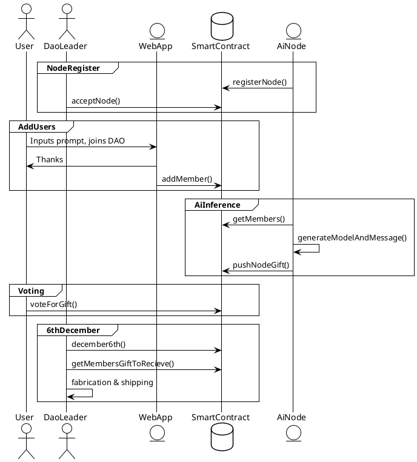

# NikolausDAO

Its a DAO for December 6th

  
    Botond and Frank
  

---
layout: intro-image-right
image: 'https://camo.githubusercontent.com/112d615f8c8a38d128d5cc79c5187795d99a7d088ecc7bef01465950fd4aeb11/68747470733a2f2f692e6962622e636f2f623271383158422f35636364386162312d656333642d346238342d623030392d3961353734313866376138642e6a7067'
---

## Problem

- 🙅‍♂️ Majority don't buy digital assets
- 🥹 Nobody understand us
- 💩 3D AI's are bad

## Solution

- 💲 Sell products, people love products
- 👩‍🦳 Grandma friendly, grandma loves things
- ⚙️ Incentives System for 3D AI's

---
layout: image-left
image: 'https://gcdnb.pbrd.co/images/KvSwJECjUUTg.png?o=1'
---

<h1>What and How?</h1>

<code>UML</code>

---

# Demo

[Live](https://nikolausdao.surge.sh/)

<iframe width="560" height="315" src="https://www.youtube.com/embed/CIYBz-gmlCs?si=ygQfiM-h4qV0GWyk" title="YouTube video player" frameborder="0" allow="accelerometer; autoplay; clipboard-write; encrypted-media; gyroscope; picture-in-picture; web-share" allowfullscreen></iframe>

---
layout: intro-image-right
image: 'https://gcdnb.pbrd.co/images/EzFVAGMGeIGn.jpg?o=1'
---

## Botond Kovács  

- 🧑‍🏭 Software Engineer 
- 💻 does devops and ai
- 🤑 wants profitable ai nodes

## Frank Dierolf

- 🧑‍🏭 Software Engineer  
- 🐉 does holograms on chain  
- 🛠️wants amazing 3D prompting tools

---
layout: fact
---

# Thank you
